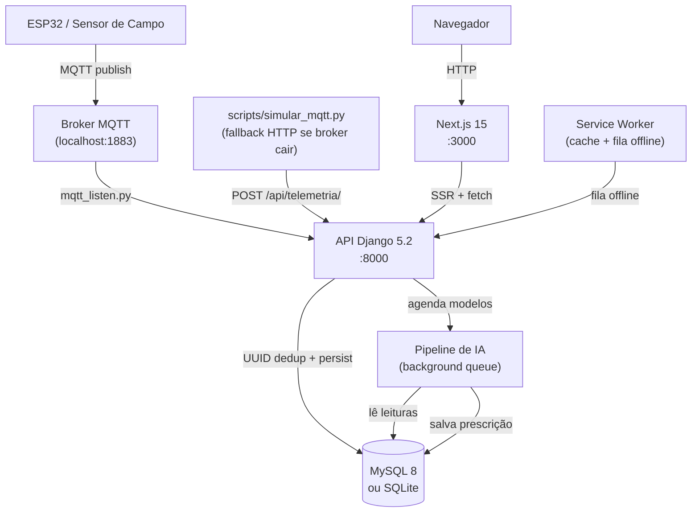
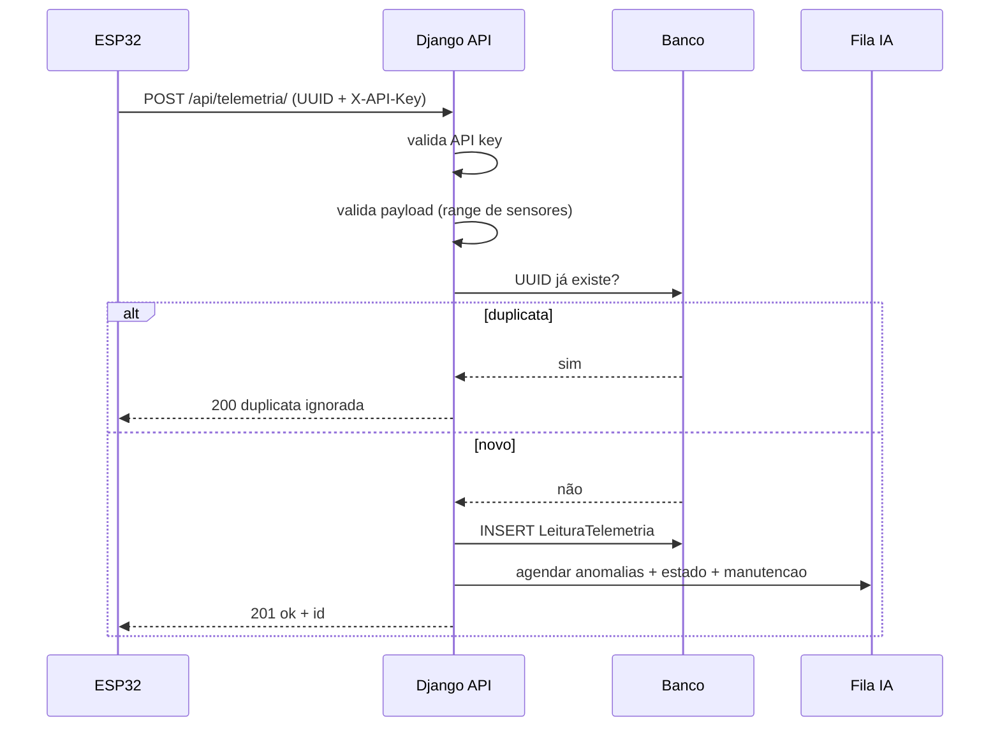
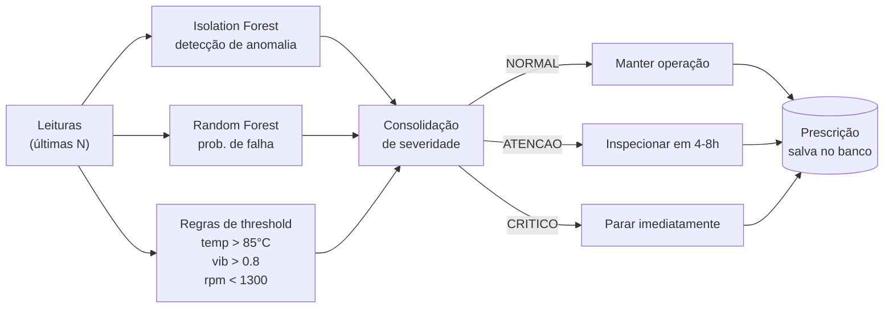

# FieldNode

Telemetria offline-first para máquinas agrícolas. Ingestão Django, dashboard Next.js e sincronização tolerante a falhas de rede rural.

---

## Arquitetura

**Nota:** O diretório oficial do frontend é o `frontend-next/`, construído em
Next.js. Versões legadas e scaffolds não utilizados foram removidos da base.



---

## Fluxo de Ingestão



---

## Pipeline de IA



---

## Stack

| Camada | Tecnologia |
| --- | --- |
| Backend | Django 5.2 + Django REST Framework |
| Frontend | Next.js 15 + React + Tailwind CSS |
| Banco | MySQL 8 em Docker / SQLite em desenvolvimento |
| IA | scikit-learn (Isolation Forest + Random Forest) |
| Hardware | ESP32, ESP-NOW, simuladores MQTT |
| Offline | Service Worker com fila de telemetria |
| Docs API | Swagger em `/swagger/` |
| Testes | Django TestCase + pytest |

---

## Setup Rápido (Docker — recomendado)

```bash
docker compose up --build
```

| Serviço | URL |
| --- | --- |
| Dashboard | http://127.0.0.1:3000/dashboard |
| API health | http://127.0.0.1:8000/api/health/ |
| Swagger | http://127.0.0.1:8000/swagger/ |

Popular banco com dados de demonstração:

```bash
docker compose exec web python manage.py popular_tudo
```

---

## Setup Local (sem Docker)

### Backend

```bash
python -m venv .venv
.venv\Scripts\activate        # Windows
# source .venv/bin/activate   # Linux/macOS
pip install -r requirements.txt
copy .env.example .env
python manage.py migrate
python manage.py treinar_isolation_forest
python manage.py runserver
```

O Isolation Forest é treinado offline com o cenário normal de bancada. O arquivo
`api_tcc/ia/modelos/isolation_forest_v1.pkl` acompanha o projeto; para regenerá-lo
de forma determinística, execute `python manage.py treinar_isolation_forest`.
Ele é um sinal não supervisionado complementar aos thresholds determinísticos.

### Frontend

```bash
cd frontend-next
npm ci
npm run dev
```

---

## Variáveis de Ambiente

Copie `.env.example` para `.env` e ajuste.

| Variável | Descrição |
| --- | --- |
| `SECRET_KEY` | Chave secreta Django |
| `FIELDNODE_API_KEY` | API key exigida no header `X-API-Key` |
| `DEBUG` | `True` em dev, `False` em produção |
| `ALLOWED_HOSTS` | Hosts permitidos pelo Django |
| `CORS_ALLOWED_ORIGINS` | Origens permitidas pelo CORS |
| `NEXT_PUBLIC_API_URL` | URL da API usada pelo browser |
| `NEXT_PUBLIC_FIELDNODE_API_KEY` | API key exposta ao browser |
| `FIELDNODE_SERVER_API_URL` | URL da API usada pelo servidor Next (container) |
| `USE_SQLITE` | `True` para SQLite em dev |
| `DB_NAME` / `DB_USER` / `DB_PASSWORD` / `DB_HOST` / `DB_PORT` | Conexão MySQL |

O `.env` está no `.gitignore`. Segredo versionado é o tipo de erro que faz banca técnica levantar a sobrancelha antes do café esfriar.

---

## Rotas do Frontend

| Rota | Descrição |
| --- | --- |
| `/dashboard` | Visão geral da frota: métricas, grid de máquinas, mapa |
| `/colheitadeiras` | Leituras recentes por máquina com badge de risco |
| `/detalhes?id=COLH-01` | Histórico, gráficos e prescrição da máquina |
| `/mapa` | Mapa de posição em campo (fallback demo se GPS ausente) |
| `/operarios` | Equipe cadastrada |
| `/maquinas` | Frota completa cadastrada |
| `/relatorios` | Geração de relatório JSON e exportação CSV |

---

## API — Endpoints

| Endpoint | Método | Autenticação | Descrição |
| --- | --- | --- | --- |
| `/api/health/` | GET | — | Checagem de saúde |
| `/api/telemetria/` | POST | `X-API-Key` | Ingestão com deduplicação UUID |
| `/api/telemetria/` | GET | — | Últimas 50 leituras (debug) |
| `/api/leituras/ultimas/` | GET | — | Última leitura por máquina com `status_risco` |
| `/api/colheitadeira/` | GET | — | Frota cadastrada |
| `/api/operario/` | GET | — | Operários cadastrados |
| `/api/anomalias/` | GET | — | Agenda detecção de anomalias (Isolation Forest) |
| `/api/manutencao/` | GET | — | Agenda análise de manutenção (Random Forest) |
| `/api/prescricoes/` | GET | — | Agenda geração de prescrição |
| `/api/prescricoes/lista/` | GET | — | Histórico de prescrições por máquina |
| `/api/relatorio/` | GET | — | Relatório operacional JSON ou CSV |
| `/api/relatorio/exportar/` | GET | — | Exportação CSV com delimitador `;` |
| `/api/maquinas/posicao/` | GET | — | Posição GPS da frota |
| `/api/metricas/` | GET | — | Leituras válidas, inválidas e taxa de rejeição |
| `/api/status-mqtt/` | GET | — | Status de conectividade MQTT |

### Exemplo de ingestão

```bash
curl -X POST http://127.0.0.1:8000/api/telemetria/ \
  -H "Content-Type: application/json" \
  -H "X-API-Key: 00000000-0000-4000-8000-000000000000" \
  -d '{
    "id": "550e8400-e29b-41d4-a716-446655440000",
    "maquina_id": "COLH-01",
    "temperatura": 78.5,
    "vibracao": 0.42,
    "rpm": 1850,
    "latitude": -15.793889,
    "longitude": -47.882778,
    "timestamp": "2026-05-28T14:32:01Z"
  }'
```

Resposta `201`:

```json
{"status": "ok", "id": "550e8400-e29b-41d4-a716-446655440000", "ia": {"status": "agendado"}}
```

Reenviar o mesmo `id` retorna `200` sem duplicar o banco:

```json
{"status": "duplicata ignorada", "id": "550e8400-e29b-41d4-a716-446655440000"}
```

---

## Simulador MQTT com Fallback HTTP

```bash
# MQTT normal
python scripts/simular_mqtt.py

# Forçar fallback HTTP (broker inacessível)
MQTT_PORT=1884 DEMO_CYCLES=1 python scripts/simular_mqtt.py
```

O simulador detecta `Connection refused`, entra em modo demo e envia diretamente para `/api/telemetria/` com coordenadas GPS reais. O sistema não para — degrada com graciosidade.

---

## Testes

```bash
# 3 casos de telemetria: ingestão válida, inválida e duplicada
python manage.py test api_tcc.tests.test_telemetria --verbosity=2

# Suite completa do backend
python manage.py test api_tcc

# Validação rápida do fluxo end-to-end
python scripts/teste_fluxo_completo.py
```

Build do frontend com verificação de tipos:

```bash
cd frontend-next && npm run build
```

---

## Resiliência Offline

O Service Worker (`/public/sw.js`) intercepta chamadas de telemetria quando o dispositivo perde conexão e enfileira via `QUEUE_TELEMETRY`. Quando a rede volta, a fila é drenada automaticamente para `/api/telemetria/`. A deduplicação UUID no backend garante que reenvios não corrompem o banco.

---

## Licença

MIT
